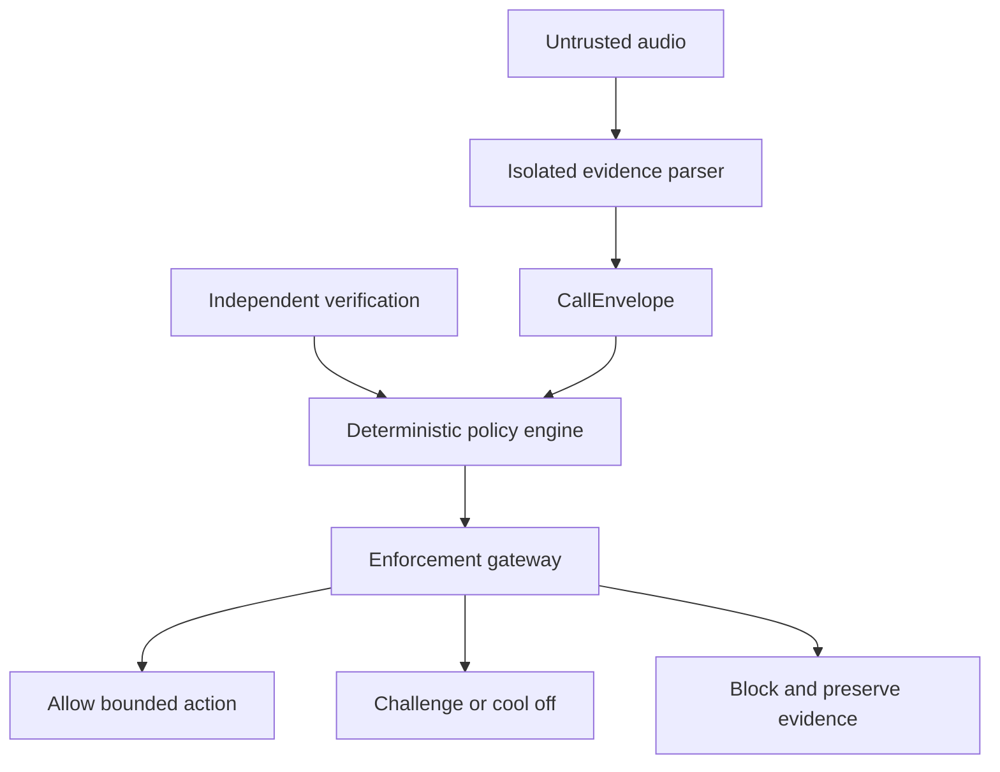

# CallGate

> A zero-trust voice firewall for moments when urgency, secrecy, and a familiar voice are being used to manufacture authority.

**Pre-hackathon research repository — no runnable product implementation is included.**

## Why this exists

CallGate was motivated by a real family scam: an older adult heard what appeared to be a grandchild's voice, was told there had been an emergency, was asked for money, and was instructed not to tell the rest of the family. The attack did not succeed merely because audio sounded convincing. It succeeded by combining affection, urgency, secrecy, and isolation.

The public version of this story is intentionally anonymized. A victim's loss is not demo material.

CallGate starts from a stronger security premise:

> **Voice is evidence, not identity. Emotion is context, not authorization.**

It does not promise to identify every cloned voice. Instead, it enforces a narrower and testable guarantee:

> **Unverified speech cannot obtain a high-impact capability.**

## The product

CallGate sits between untrusted real-time audio and any person, AI agent, or tool that could disclose sensitive information or take consequential action. It turns an incoming call into a bounded trust decision:

1. Treat every audio stream as untrusted data.
2. Extract claims and risk signals inside a capability-isolated parser.
3. Verify identity and authority through an independent channel.
4. Apply deterministic policy before any action is possible.
5. Record a privacy-preserving, tamper-evident decision receipt.

## What makes it different

- **Human-factors security:** secrecy, urgency, shame, authority, and requests for money are first-class signals—not footnotes in a deepfake score.
- **No AI bypass:** the model can describe risk, but it cannot grant permission, call tools, alter policy, or suppress verification.
- **Independent proof:** caller ID, a convincing voice, or a model's confidence can never verify identity alone.
- **Safe friction:** a high-risk call can enter a cooling-off state even when the recipient wants to proceed in the moment.
- **Dignity by design:** the interface does not shame a potential victim or demand that they understand AI terminology.
- **Agent-ready:** the same trust envelope can mediate future agent-to-agent voice requests.

## Trust states

| State | Meaning | Permitted outcome |
|---|---|---|
| `UNVERIFIED` | Audio has arrived, but identity and authority are unknown | Listen, transcribe, summarize |
| `CHALLENGED` | Independent verification is pending | No high-impact action |
| `COOLING_OFF` | Coercive or high-risk pattern requires time and separation | Safe callback and trusted support only |
| `VERIFIED_BOUNDED` | Identity and a specific capability were independently verified | Only the scoped action until expiry |
| `ESCALATED` | Evidence is conflicting or safety context is sensitive | Human review using a user-chosen path |
| `BLOCKED` | Policy or challenge failed | No action; preserve a minimal receipt |

## Security invariants

1. Raw speech never reaches a tool-enabled agent.
2. No probabilistic detector can grant authority by itself.
3. High-impact capabilities require independent verification and explicit human confirmation.
4. A request combining secrecy, urgency, and money cannot complete within the same call session.
5. Model output cannot modify policy, credentials, verification status, or enforcement state.
6. Raw audio is ephemeral by default; receipts store hashes and bounded facts, not a surveillance archive.

## Repository map

- [`PRE_HACKATHON_BOUNDARY.md`](PRE_HACKATHON_BOUNDARY.md) — competition-compliance boundary
- [`docs/ARCHITECTURE.md`](docs/ARCHITECTURE.md) — systems architecture and failure containment
- [`docs/THREAT_MODEL.md`](docs/THREAT_MODEL.md) — assets, adversaries, attack paths, mitigations
- [`docs/ETHICS_AND_HUMAN_FACTORS.md`](docs/ETHICS_AND_HUMAN_FACTORS.md) — enforceable ethics and vulnerable-user design
- [`docs/TRUST_ENVELOPE_SPEC.md`](docs/TRUST_ENVELOPE_SPEC.md) — protocol and policy contracts
- [`docs/TEST_AND_EVIDENCE_PLAN.md`](docs/TEST_AND_EVIDENCE_PLAN.md) — red-team matrix and honest metrics
- [`docs/USER_RESEARCH_PROTOCOL.md`](docs/USER_RESEARCH_PROTOCOL.md) — consent-first usability research
- [`docs/HACKATHON_36H_PLAN.md`](docs/HACKATHON_36H_PLAN.md) — build sequence for the event
- [`docs/DEMO_AND_PITCH.md`](docs/DEMO_AND_PITCH.md) — three-minute narrative and demo choreography
- [`docs/PRODUCT_STRATEGY.md`](docs/PRODUCT_STRATEGY.md) — differentiation, moat, and expansion path
- [`BACKLOG.md`](BACKLOG.md) — scoped implementation issues

## Intended event strategy

The research, diagrams, and specifications in this repository may be published before the event. The runnable application, integrations, models, and UI must be implemented during the hackathon on a clearly marked event branch. The boundary is documented so judges can distinguish preparation from judged work.

## Technical references

- [NIST SP 800-207: Zero Trust Architecture](https://csrc.nist.gov/pubs/sp/800/207/final)
- [W3C Web Authentication Level 3](https://www.w3.org/TR/webauthn-3/)
- [FTC: Fighting back against harmful voice cloning](https://consumer.ftc.gov/consumer-alerts/2024/04/fighting-back-against-harmful-voice-cloning)
- [FCC: AI-generated voices in robocalls](https://www.fcc.gov/consumers/guides/deep-fake-audio-and-video-links-make-robocalls-and-scam-texts-harder-spot)
- [AT-ADD: audio deepfake detection under real-world conditions](https://arxiv.org/html/2604.08184v1)

## License

Research documents and eventual source code are planned for release under the [MIT License](LICENSE).
