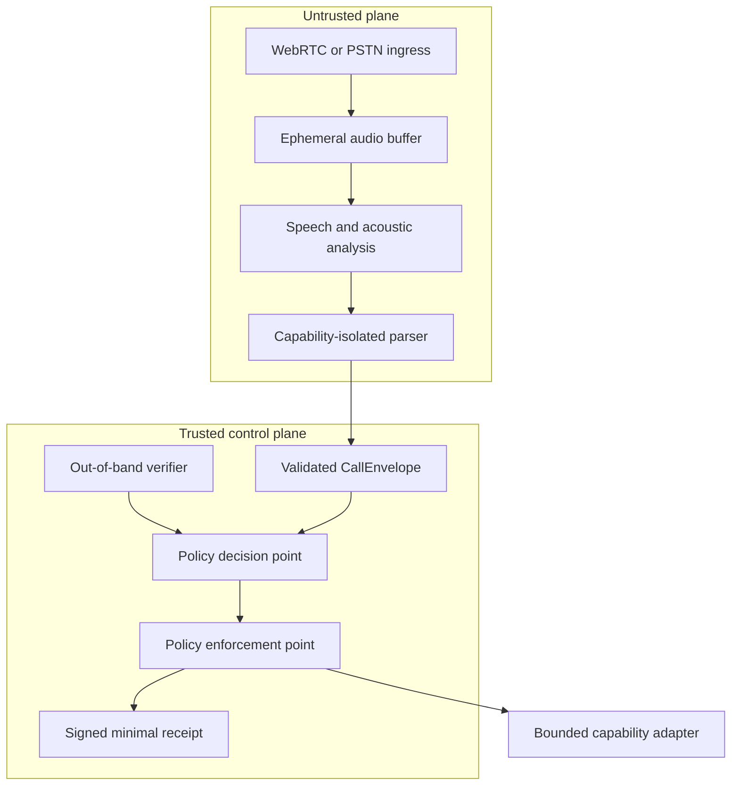
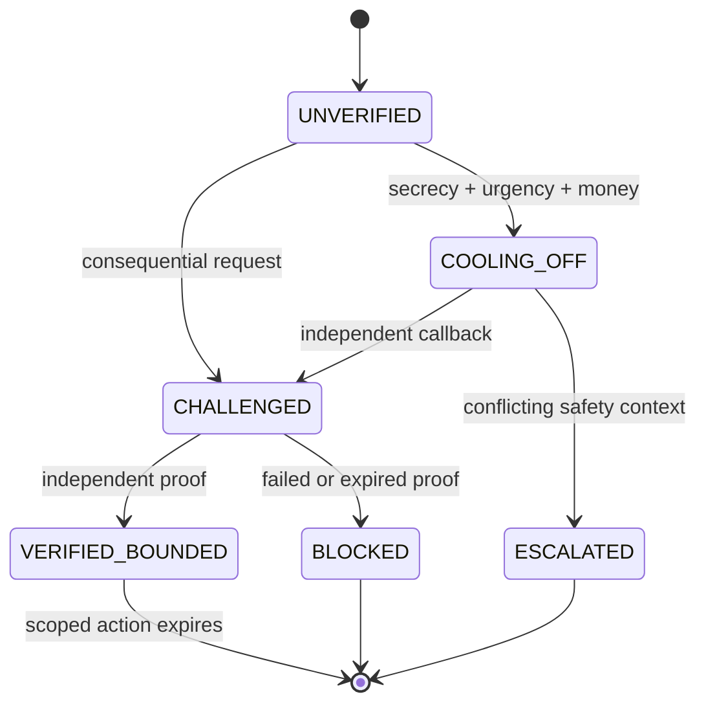

# Architecture

## Design goal

CallGate is a **policy enforcement system**, not a deepfake classifier with a phone UI. Detection models are uncertain and can fail under new generators, codecs, noise, replay, and adversarial adaptation. The safety boundary must therefore remain intact even when every probabilistic component is wrong.

## Trust topology



The term **capability-isolated** is deliberate. A normal cloud deployment is not literally air-gapped. Isolation must be demonstrated through separate identities, networks, credentials, APIs, and allowlists—not claimed through branding.

## Components

### 1. Ingress adapter

- Accepts WebRTC in the hackathon version; PSTN/VoIP can be a later adapter.
- Assigns a random session ID and keeps caller ID as an untrusted claim.
- Sends short audio frames to an ephemeral buffer.
- Has no access to contacts, payment systems, messages, or verification secrets.

### 2. Ephemeral audio buffer

- Memory-only or short-TTL encrypted storage.
- Deletes raw frames after the bounded analysis window unless the user explicitly opts in to preserve evidence.
- Emits an auditable deletion event without recording audio content.

### 3. Speech and acoustic analysis

Produces evidence, never a verdict:

- Transcript segments with timestamps and confidence.
- Replay, synthesis, discontinuity, and channel-anomaly signals.
- Language, codec, noise, and model-version metadata.
- Explicit `unknown` when quality is insufficient.

A deepfake score can increase caution but cannot identify a person, prove fraud, or authorize an action.

### 4. Capability-isolated parser

The LLM receives only bounded transcript windows and a fixed extraction schema. It has:

- No tools
- No credentials
- No network egress beyond the model endpoint
- No access to contacts or prior private conversations
- No permission to choose an action

Its only output is a candidate `CallEnvelope`. Schema validation rejects extra fields, instructions, markup, encoded payloads, oversized strings, or references to nonexistent evidence.

### 5. Evidence verifier

Independent verification options:

- Call back a known number from the recipient's contacts.
- Send a one-time approval to a previously enrolled device.
- Use a WebAuthn credential for a registered organization or agent.
- Resolve an official number/domain from a trusted directory.
- Ask a user-selected trusted contact without disclosing unnecessary call content.

WebAuthn proves control of an RP-scoped credential. It does not, by itself, prove that someone works for a bank or is authorized to request a transfer. Organizational authority requires enrollment and policy.

### 6. Policy decision point

A deterministic, versioned state machine combines:

- Requested capability and potential harm
- Verification evidence
- Coercion signals: urgency, secrecy, shame, authority pressure, isolation
- Acoustic and channel evidence
- User-specific policy configured before the stressful event
- Accessibility and safety exceptions

The policy engine can only return a closed enum: `ALLOW_BOUNDED`, `CHALLENGE`, `COOL_OFF`, `ESCALATE`, or `BLOCK`.

### 7. Policy enforcement point

The enforcement gateway is the only component able to mint a capability token. It verifies:

- Policy decision signature and version
- Session binding
- Independent verification result
- Human confirmation where required
- Scope, amount/resource, expiry, and single-use nonce

Even a compromised UI or parser cannot bypass this gate.

### 8. Bounded capability adapter

The hackathon demo should use a **simulated high-impact tool**, never a real payment rail. Example token:

```json
{
  "session_id": "random-session",
  "action": "share_callback_window",
  "resource": "appointment-123",
  "expires_in_seconds": 120,
  "max_uses": 1,
  "human_confirmation": true
}
```

No wildcard action, unbounded amount, reusable token, or cross-session token is valid.

### 9. Receipt service

Stores the minimum needed to prove what happened:

- Random request/session ID
- Timestamp, model version, policy version
- Hashes of normalized input and decision
- Evidence references and trust-state transition
- Verification method and result
- No raw audio or full transcript by default

SHA-256 provides tamper evidence for a stored artifact; it does not prove that the original claim was true. If stronger public verification is needed, receipts can be signed with a service key and verified against a published key.

## Human protection flow



## Failure containment

| Failure | Required behavior |
|---|---|
| Deepfake detector misses a clone | High-impact action still requires independent proof |
| Deepfake detector flags a real relative | Do not accuse; challenge through a known channel |
| Parser follows prompt injection | Schema validation and deterministic policy prevent authority gain |
| Policy service unavailable | Fail closed for high-impact actions; allow ordinary conversation |
| Verification provider unavailable | Offer known-channel callback and cooling-off; never silently allow |
| Receipt store unavailable | Do not block ordinary listening; block capability issuance that requires audit |
| UI compromised | Enforcement validates signed decision and verification independently |
| Trusted contact is unsafe | Respect user-configured private escalation route; never automatically notify family |

## Deployment hypothesis for the event

- Browser/WebRTC client for the dramatic, controllable demo
- Separate containers for ingress/parser, verifier, policy, enforcement, and dashboard
- Per-service identities and deny-by-default network policy
- Typed schema shared as a generated package after the event starts
- OpenTelemetry traces with transcript content redacted
- GPU inference only if sponsor infrastructure and time make it reliable

The event build should optimize for a provable trust boundary, not the largest number of integrations.

