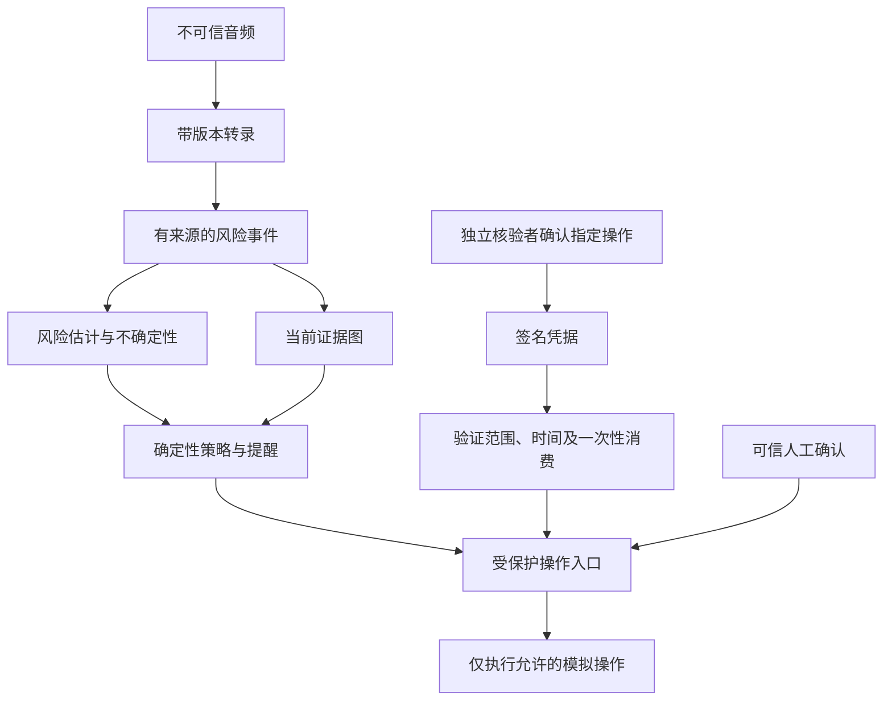

# CallGate 数学逻辑框架 v0.1

日期：2026-09-09。用途：统一实现、评测与项目讲述。本文定义框架和验收性质，并非已经完成形式化证明或真实场景有效性验证。

## 1. 问题与信任边界

系统观察不可信通话，提取有来源的证据，估计风险，并通过独立核验控制受保护的操作。攻击者可改变措辞、冒充身份、施加压力、注入指令或重放已取得的凭据。

基础假设：服务端策略与注册公钥未被篡改，核验者私钥受保护，执行端无法绕过验证入口，时钟和持久化存储可用。现有原型尚未提供真实身份注册、真实人工确认渠道或生产执行端；因此端到端安全目标仍是待验收目标。

图表示目标连接关系。当前证据图是回放投影；确认、签名与执行入口是独立测试组件，尚未自动接入语音状态机。

## 2. 对象与数据契约

一次会话记为 s，当前时刻为 t，操作为 a，目标资源为 r。

转录片段 x=(id, revision, text, start, end, final, role)。同一 id 只保留最新被接受的版本；过时输入忽略，同版本内容冲突拒绝，已最终确定的片段不能退回临时状态。

风险事件 e=(id, segment_id, revision, kind, span, extractor)。来源必须满足：片段存在、版本匹配、0 ≤ span.start < span.end ≤ 文本长度。该条件证明引用有效，不证明提取语义正确。

临时证据 E_provisional 可产生预览分数；确定证据 E_final 才参与当前规则策略。未知角色和不支持的语言必须显示不确定性。

## 3. 图论：证据可追溯

G_t=(V_t,E_t)，当前节点类型为转录版本、风险事件、风险类别；边表示提取来源和支持关系。

约束：每个风险事件可追溯到一个有效转录版本；修订后不保留旧版本作为当前证据；临时事件不能支持已确定风险类别；跨会话不共享节点。类别汇总用于去重，不能把同一句话重复出现当成多份独立证据。

已复用 NetworkX 构建有向图。当前未实现真实人物实体解析、因果图或 GNN。文字提到某银行不产生“已验证银行”节点。

## 4. 风险估计：规则基线与概率扩展

当前规则参考分：R_t=min(100, Σ_k w_k · 1[k 出现在 E_final])。

权重为 authority=10、urgency=15、secrecy=20、money=35、credentials=60、remote_access=45、injection=30。它们是设计参数，不是经验概率；风险事件的固定 confidence=0.7 也不是已校准置信度。策略直接检查类别组合，而不是仅按分数阈值决定。

未来定义 F 为经标注的欺诈标签、E 为证据、C 为场景，研究 p_t=P(F=1|E,C)。贝叶斯更新需要先验及联合似然；多个相关信号不能未经验证就按条件独立相乘。pgmpy 可提供推断实现，参数仍须从合法且合适的数据估计。无可靠数据时返回未校准状态，不把 R_t/100 当成 p_t。

模型不确定性高、语言不支持或数据漂移时，应退回规则提醒/人工核验；不能因此自动授权。

## 5. 信息论与决策代价（设计阶段）

H(F|E) 衡量所定义分布的条件不确定性。候选问题 q 的期望信息增益为 IG(q)=H(F|E)-Σ_z P(z|E,q)H(F|E,z,q)。概率模型、回答分布和成本尚未估计，当前不执行此优化。

问题优先级可研究 IG(q)-λ·用户负担(q)-μ·额外风险(q)。来电者的回答仍属不可信输入，不能替代独立渠道。

对允许的干预集合 A_safe，决策可研究 argmin_a Σ_y P(y|E)L(a,y)。损失矩阵应包含漏报伤害、误报干扰、延迟和用户负担。硬性授权约束先限定 A_safe，期望损失不能使不合规动作变得可执行。

## 6. 状态机：保守干预

| 当前证据/历史条件 | 当前实现的状态 |
|---|---|
| 确定证据含索取密码或验证码 | BLOCKED |
| 非 BLOCKED，保密要求与高影响请求同时存在 | COOLING_OFF |
| 非锁定状态，出现高影响请求 | CHALLENGED |
| 非锁定状态，未出现以上条件 | UNVERIFIED |

高影响类别为 money、credentials、remote_access。BLOCKED 与 COOLING_OFF 在当前会话中锁定；转录修正可以降低当前分数，但不会自动解除这两种状态。CHALLENGED 可以随证据撤回而回到 UNVERIFIED。

当前图展示现有证据，状态可保留历史干预，因此图为空、分数为零与 BLOCKED 可以并存。这不是“仍检测到危险”的证明。未来需将锁定原因、历史来源及解除流程显式化；当前没有自动解除或 VERIFIED 状态。

## 7. 密码学与独立核验

核验请求 q 绑定 request_id、指定 reviewer、s、a、r、issued_at、expires_at。核验者签名覆盖整个 q 和批准/拒绝值。服务端验证存储请求完全相同、时间有效及登记公钥对应签名，才签发凭据。

凭据 c 绑定 version、issuer、s、a、r、issued_at、expires_at、nonce。用 cryptography 的 Ed25519 签署确定性序列化字节。拒绝未知签发者、字段篡改、跨会话、扩大范围、未生效或过期凭据。

签名证明相应密钥对该消息作出认可；它不能证明密钥持有者身份真实、未被胁迫或判断正确。原型测试使用生成密钥模拟核验者，尚未完成人工登录。

## 8. 授权与原子消费

目标准入谓词：Admit(c,s,a,r,t)=SignatureValid ∧ IssuerTrusted ∧ ScopeMatches ∧ TimeValid ∧ HumanConfirmed ∧ PolicyAllows ∧ ConsumeOnceSucceeded。

ConsumeOnce 是具有副作用的原子操作，不能先查询“未消费”再独立写入。SQLite 用事务和 (issuer,nonce) 唯一键实现一个主机上的多连接互斥消费；锁取得后重新检查有效期。

性质：对同一数据库和同一凭据，成功准入次数 ≤ 1。持久化模式下记录跨进程保留。删除数据库或恢复旧备份会破坏这个前提。默认内存模式仅用于临时演示，必须显式配置 SQLite 才有持久化性质。

这只是至多一次准入，不能推导外部支付恰好执行一次。消费后崩溃可能没有响应，真实工具需事务性衔接或幂等协议。当前唯一动作是 simulate_protected_action，始终报告 real_action_executed=false。

## 9. 验收矩阵与实现状态

| 层 | 已有证据 | 仍需完成 |
|---|---|---|
| 转录与规则 | 版本、来源范围、修订和多种话术测试 | 更强语义、语言和角色识别 |
| 图 | NetworkX 回放图，节点与边引用测试 | 历史原因、实时投影和实体解析 |
| 核验 | 登记测试公钥、签名确认、范围/过期/篡改测试 | 真人注册、可信界面、撤销和密钥管理 |
| 执行 | 模拟 gate、SQLite 并发与跨进程测试 | 与语音策略连接、真实可信确认来源 |
| 概率/信息论 | 混淆矩阵、开发集比率与 Wilson 区间；推断定义与候选库 | 独立样本、参数、校准与有效性实验 |
| GNN/ZK/激励 | 研究候选 | 当前无集成；按产品需求再决定 |

最近一次完整本地测试为 90 passed。25 个同作者合成开发案例得到 TP=15、FP=0、FN=1、TN=9；提醒召回 93.75% 的 Wilson 95% 区间为 71.7%–98.9%，特异度 100% 的区间为 70.1%–100%。宽区间直接显示样本很小；这些数字是开发回归结果，不是现实准确率或数学证明。签名凭据只能证明快照未被篡改，不能证明风险判断正确。

后续评测按时间、主体和话术家族隔离，报告误报率、召回率、校准误差、拒答覆盖率及端到端时延。对未知攻击和反馈投毒分别测量。优先验证以上约束，再比较复杂模型是否优于简单基线。

## 10. 项目叙述

数学与计算机的结合落在三个可展示点：用图描述证据来源，用状态机和逻辑合取限定授权条件，用事务测试检验一次性消费性质。复用 NetworkX、cryptography 和 SQLite；CallGate 的工作是把证据、策略与核验组织成明确的接口和约束，并设计反例测试。

概率推断、信息增益和 ZK 仍是扩展设计，不应在简历中写成已部署能力。个人贡献应与本人实际设计、实现和验证的工作一致。
