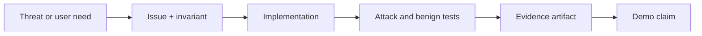

# Repository Workflow

## Why the workflow matters

The repository must prove what existed before the event, what was created during it, and whether every headline claim is backed by an issue, test, trace, or receipt.

## Branches and tags

- `main`: public research before the event; stable demo after the event
- `pre-hackathon-research-v1`: immutable research boundary tag
- `hackathon/la-hacks-2026`: all judged implementation work
- Short branches: `feat/CG-###-description`, merged with linked evidence

## Issue workflow

Every implementation issue must include:

- User harm or security threat
- Trust boundary affected
- Acceptance criteria
- Negative/abuse test
- Privacy impact
- Evidence artifact expected
- Event-built disclosure

## Evidence naming

- `evidence/CG-###/test-results.json`
- `evidence/CG-###/trace-redacted.json`
- `evidence/CG-###/receipt.json`
- `evidence/CG-###/README.md`

No private audio, full transcript, secret, phone number, or victim information belongs in Git.

## GitHub automation plan

Repository automation can help after the event starts:

- Validate Markdown links and diagrams
- Run schema, unit, property, and integration tests
- Generate a software bill of materials
- Scan secrets and dependencies
- Attach signed provenance to releases
- Build the redacted judge evidence package

If GitHub Agentic Workflows or a similarly named tool is used, treat its output as untrusted proposed changes. It must not receive production secrets or approve its own security changes. Traditional CI gates remain authoritative.

## Pull-request checklist

- [ ] Linked issue and invariant
- [ ] No expansion beyond requested capability
- [ ] Untrusted model output remains outside trusted fields
- [ ] Failure is safe and visible
- [ ] Test includes attack and benign case
- [ ] Logs redact sensitive content
- [ ] Evidence artifact generated
- [ ] Built-during-event field updated

